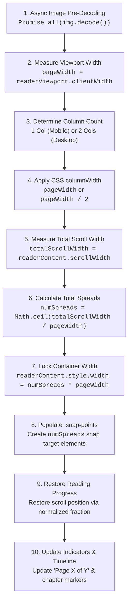

# Zenolet Reader Engine: Architecture & Pagination Algorithm

> **A deep dive into Zenolet's horizontal, book-like reading engine — how continuous EPUB XHTML is paginated, snapped, and navigated 100% client-side with native web standards.**

---

## 📖 1. Philosophy & Architectural Goal

Traditional web reading experiences rely on endless vertical scrolling. While simple to implement, vertical scrolling loses the physical tactility and spatial memory associated with reading physical books.

**Zenolet** was designed to recreate the feel of turning pages across discrete single-page or two-page spreads. Rather than breaking books into fragmented HTML chunks, using heavy rendering engines, or drawing to `<canvas>`, Zenolet uses a high-performance, standard-compliant approach:

- **Native CSS Multi-Column Layout** for fluid, column-based text pagination.
- **Hardware-Accelerated CSS Scroll Snapping** for instant, jitter-free page turning.
- **Scale-Invariant Normalized Progress Fractions** for reading position preservation across device rotations, font size changes, and window resizes.

---

## 🏗️ 2. The DOM & Layout Hierarchy

The reader's DOM structure cleanly separates the scroll container from the content and snapping layers:

```
┌────────────────────────────────────────────────────────────────────────┐
│ .reader-container (Fixed height: 100dvh - header - footer)            │
│                                                                        │
│  ┌──────────────────────────────────────────────────────────────────┐  │
│  │ .reader-viewport (overflow-x: scroll, scroll-snap-type: x)       │  │
│  │                                                                  │  │
│  │  ├─ .snap-points (Layer 1 - Invisible Snap Anchor Targets)       │  │
│  │  │  [Target Spread 0] [Target Spread 1] [Target Spread 2] ...     │  │
│  │  │                                                               │  │
│  │  └─ .reader-content (Layer 2 - Multi-Column Text Flow)           │  │
│  │     ┌──────────────┬──────────────┬──────────────┬─────────────┐ │  │
│  │     │ Chapter 1    │ ...continued │ ...continued │ Chapter 2   │ │  │
│  │     │ Paragraph 1  │ Paragraph 3  │ Paragraph 5  │ Paragraph 1 │ │  │
│  │     │ Paragraph 2  │ Paragraph 4  │ Paragraph 6  │ Paragraph 2 │ │  │
│  │     └──────────────┴──────────────┴──────────────┴─────────────┘ │  │
│  └──────────────────────────────────────────────────────────────────┘  │
└────────────────────────────────────────────────────────────────────────┘
```

### Key CSS Rules ([`src/style.css`](./src/style.css))

1. **Fixed Container Height**:
   ```css
   .reader-container {
     width: 100%;
     height: calc(100dvh - var(--header-height) - var(--footer-height));
     position: relative;
     overflow: hidden;
   }
   ```
2. **Horizontal Viewport & Mandatory Snapping**:
   ```css
   .reader-viewport {
     width: 100%;
     height: 100%;
     overflow-x: scroll;
     overflow-y: hidden;
     scroll-snap-type: x mandatory;
     scroll-behavior: auto;
     scrollbar-width: none; /* Hidden scrollbars for clean book aesthetic */
   }
   ```
3. **Multi-Column Flow Engine**:
   ```css
   .reader-content {
     position: absolute;
     top: 0;
     left: 0;
     height: 100%;
     column-fill: auto;
     column-gap: 0;
   }
   ```

When content exceeds the vertical height of the viewport, the browser automatically breaks and continues the text in the next column to the right.

4. **Chapter & Line Break Pagination**:
   - **Inter-Spine Chapters**: `.epub-chapter` enforces `break-before: column; page-break-before: always;` (with `.epub-chapter:first-child` set to `break-before: auto;`), ensuring each new chapter starts at the top of a new column/page spread.
   - **General `<hr>` Elements**: Transformed into invisible column breaks (`border: 0; visibility: hidden; break-before: column;`), replacing horizontal rule lines with natural vertical whitespace at the bottom of the ending page and advancing to the top of the next page.
   - **Scene & Thought Breaks**: Intra-chapter scene breaks (`hr.tb`, `hr.short`, `hr.r5`..`hr.r50`, `hr.thought-break`, `hr.footnotes`) are styled with generous vertical whitespace (`margin: 1.8em 0; break-before: auto;`) without forcing an unwanted page turn.
   - **Redundant Break Suppression**: Leading (`hr:first-child`), trailing (`hr:last-child`), and consecutive (`hr + hr`) horizontal rules are suppressed (`display: none !important;`) to prevent accidental blank pages.

---

## 🧮 3. The Layout & Pagination Algorithm

The core layout calculation is handled by `recalculatePages()` in [`src/components/ReaderEngine.ts`](./src/components/ReaderEngine.ts):



### Step 1: Asynchronous Image Pre-Decoding

Before measuring DOM scroll dimensions, all inlined base64 images must be fully decoded:

```typescript
await Promise.all(
  images.map((img) => {
    if (img.complete && img.naturalHeight !== 0) return Promise.resolve();
    if (typeof img.decode === 'function') return img.decode().catch(() => {});
    return new Promise<void>((resolve) => {
      img.onload = () => resolve();
      img.onerror = () => resolve();
    });
  })
);
```

_Why this matters:_ If `scrollWidth` is calculated while images are still decoding, the total page count will be underestimated, truncating trailing chapters.

### Step 2: Dynamic Column Sizing

Based on the screen size and user preference:

- **1-Column (Single Page)**: `columnWidth = pageWidth` (< 768px in Auto mode)
- **2-Column (Two-Page Spread)**: `columnWidth = pageWidth / 2` (768px–1499px in Auto mode)
- **3-Column (Three-Page Spread)**: `columnWidth = pageWidth / 3` (≥ 1500px in Auto mode)

### Step 3: Spread Counting & Snap Point Injection

```typescript
const totalScrollWidth = readerContent.scrollWidth;
const numSpreads = Math.max(1, Math.ceil(totalScrollWidth / pageWidth));

state.totalPagesSpreads = numSpreads;
readerContent.style.width = `${numSpreads * pageWidth}px`;

// Generate snap targets
snapPoints.innerHTML = '';
snapPoints.style.width = `${numSpreads * pageWidth}px`;

for (let i = 0; i < numSpreads; i++) {
  const snapTarget = document.createElement('div');
  snapTarget.className = 'snap-target';
  snapTarget.style.width = `${pageWidth}px`;
  snapPoints.appendChild(snapTarget);
}
```

---

## 📐 4. Scale-Invariant Progress Math

Pixel-based scroll offsets (`scrollLeft`) are unstable: as soon as a reader rotates their phone from portrait to landscape, changes font size, or resizes the browser window, absolute pixel coordinates no longer point to the correct text.

To solve this, Zenolet represents reading position as a **normalized continuous fraction** ($0.0 \le \text{fraction} \le 1.0$):

### Saving Progress

$$\text{progressFraction} = \frac{\text{scrollLeft}}{\text{scrollWidth} - \text{clientWidth}}$$

### Restoring Progress

When the layout recalculates, the saved fraction is restored to the nearest discrete spread **before** pagination labels update:

$$\text{maxScroll} = \text{scrollWidth} - \text{clientWidth}$$
$$\text{targetSpread} = \text{round}\left(\frac{\text{progressFraction} \times \text{maxScroll}}{\text{pageWidth}}\right)$$
$$\text{viewport.scrollLeft} = \text{targetSpread} \times \text{pageWidth}$$

This guarantees that the user stays on the exact same paragraph across any layout modification.

---

## 🧭 5. Navigation & Chapter Jumping

### Determining the Current Page Spread

```typescript
const currentSpread = Math.min(state.totalPagesSpreads - 1, Math.max(0, Math.round(scrollLeft / pageWidth)));
```

- In **1-column mode**: `"Page {currentSpread + 1} of {totalPagesSpreads}"`
- In **2-column mode**: `"Pages {currentSpread * 2 + 1}–{currentSpread * 2 + 2} of {totalPagesSpreads * 2}"`
- In **3-column mode**: `"Pages {currentSpread * 3 + 1}–{currentSpread * 3 + 3} of {totalPagesSpreads * 3}"`

### Anchor & Chapter Resolution ([`src/components/Timeline.ts`](./src/components/Timeline.ts))

When a user clicks a Table of Contents entry, footnote anchor, or timeline chapter dot, `getElementSpreadIndex()` determines which horizontal page spread contains that element:

```typescript
export function getElementSpreadIndex(
  targetEl: HTMLElement,
  readerViewport: HTMLDivElement,
  totalPagesSpreads: number
): number {
  const pageWidth = readerViewport.clientWidth;
  if (pageWidth <= 0) return 0;

  const targetRect = targetEl.getBoundingClientRect();
  const viewportRect = readerViewport.getBoundingClientRect();

  // Compute absolute horizontal offset inside the scrolled content
  const absoluteLeft = targetRect.left - viewportRect.left + readerViewport.scrollLeft;
  const spreadIndex = Math.floor(absoluteLeft / pageWidth);

  return Math.min(totalPagesSpreads - 1, Math.max(0, spreadIndex));
}
```

The reader then scrolls smoothly to `spreadIndex * pageWidth`.

---

## 🖱️ 6. Gestures & Interaction Modes

The reader engine supports multiple simultaneous input modalities:

1. **Touch Swiping & Mobile Gestures**:
   Hardware-accelerated native touch gestures and momentum swipe on mobile and tablet devices (iPad, iPhone, Android) automatically trigger CSS scroll snapping to discrete page spreads.
2. **Desktop Text Selection**:
   Standard cursor over book content allows natural text selection, highlighting, and copying without interfering with viewport scrolling.
3. **Keyboard Shortcuts**:
   - `ArrowRight` / `Space`: Turn forward one page spread.
   - `ArrowLeft` / `Shift + Space`: Turn backward one page spread.
4. **Prev / Next Buttons**:
   Triggers `readerViewport.scrollBy({ left: ±pageWidth, behavior: 'auto' })`.

---

## 🔗 Key Source Files

- [`src/components/ReaderEngine.ts`](./src/components/ReaderEngine.ts): Multi-column layout recalculation, pagination indicators, themes, and font sizing.
- [`src/style.css`](./src/style.css): Multi-column CSS rules, viewport scroll snapping, and reader typography.
- [`src/components/Timeline.ts`](./src/components/Timeline.ts): Structured TOC / heading discovery, chapter markers, and element spread index calculation.
- [`src/services/storage.ts`](./src/services/storage.ts): Scale-invariant reading progress fraction persistence and restoration.
- [`src/main.ts`](./src/main.ts): Application lifecycle, image decoding orchestration, and event listeners.
